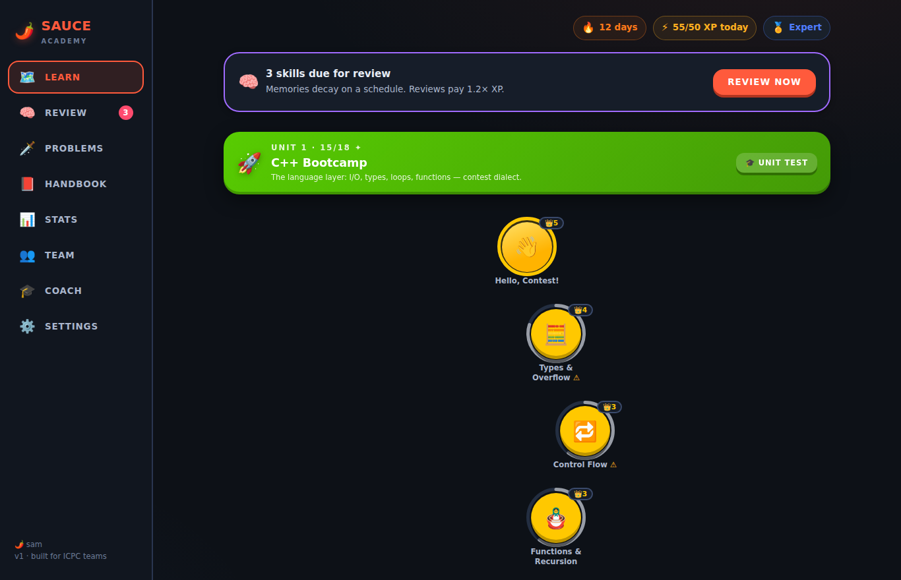
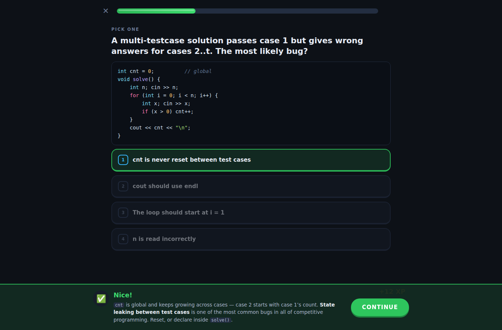
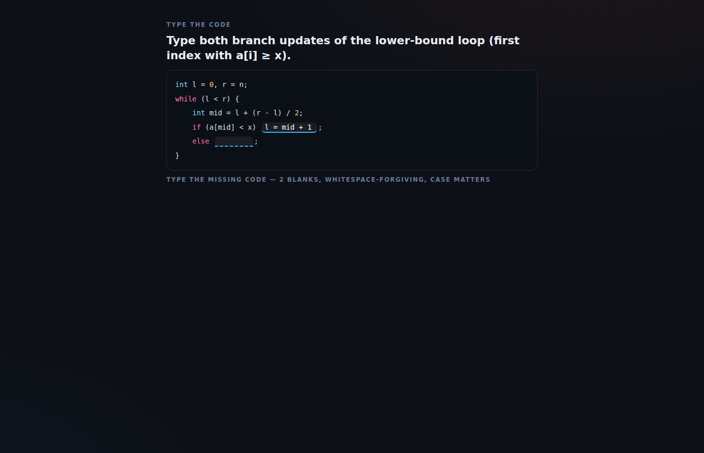
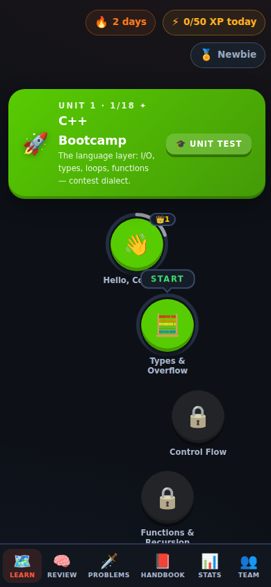

# 🌶️ SAUCE Academy

**An interactive, research-backed trainer that takes you and your ICPC team
from `int main()` to regionals — Duolingo-style.**

SAUCE started life as [`SAUCE.cpp`](SAUCE.cpp) — *Samuel's All-Purpose Ultimate
Competitive Engine*, a single-file C++ contest handbook. It's now a full
training platform built around that handbook: **12 units · 54 skills · ~700
interactive exercises · a curated ladder of 180+ verified CSES/Codeforces
problems**, wrapped in a spaced-repetition engine and a gamification layer
tuned for serious learners.

No accounts. No backend. No build step. Clone → open → train.

| The path | Lessons with elaborated feedback |
|---|---|
|  |  |

| Type-the-code drills | Mobile |
|---|---|
|  |  |

---

## ⚡ Quick start

```bash
git clone https://github.com/Sam-T-G/SAUCE-ICPC.git
cd SAUCE-ICPC
python3 -m http.server 8000        # or: npx serve, or any static server
# open http://localhost:8000
```

That's it. Progress saves to your browser (localStorage); export/import it
from **Settings** or the **Team** tab.

> **GitHub Pages**: enable Pages for the repo (Settings → Pages → Deploy from
> branch → `main`, root) and the whole app is hosted at
> `https://<you>.github.io/SAUCE-ICPC/` — one URL for the whole team. A
> ready-made workflow lives in `.github/workflows/pages.yml`.

## 🗺️ What's inside

| Tab | What it does |
|---|---|
| **Learn** | A single winding path through 12 units / 54 skills. Each skill: theory cards → interactive lessons → crown levels 0–5. One obvious "next thing to do," always. |
| **Review** | The spaced-repetition hub. Skills decay on a forgetting curve; due reviews are interleaved across topics with the skill names hidden — recognizing the technique *is* the exercise. Plus your mistake bank and cold re-solve queue. |
| **Problems** | 180+ curated, verified CSES/Codeforces problems mapped to each skill, ordered by difficulty, with a "why this problem" note. Tracks solo vs editorial-assisted solves — assisted ones come back in 14 days for a cold re-solve. |
| **Handbook** | The SAUCE reference, searchable, with copy-ready snippets for your 25-page ICPC Team Reference Document — plus the interactive **"Which tool do I use?"** wizard and a C++ **playground** (remote compile via Piston). |
| **Stats** | XP, streak, accuracy by exercise type (your weakness menu), mastery per unit, activity heatmap, badges. |
| **Team** | No-server team features: export your progress file, import teammates', compare coverage. Commit exports to `team/` and the leaderboard works for everyone on git pull. |
| **Coach** | How to actually train: weekly loops, editorial discipline, penalty math, team roles, a 16-week plan to regionals — with named sources. |

### The exercise engine

Eleven interactive exercise types implement the research-backed learning
ladder (*trace → assemble → complete → typed recall → write*):

multiple choice · true/false · multi-select · typed answers ·
**predict-the-output** (tracing) · **Parsons problems** (drag/tap code into
order) · **token-bank code completion** · **type-into-the-code blanks**
(typed recall, case-sensitive) · matching pairs · ordering · and full
**write-the-code exercises with a built-in judge** (compiles and runs
your C++ remotely, or self-check offline).

Every answer — right or wrong — gets an explanation. Mistakes re-queue until
you clear them, sessions end on a win, and your misses feed targeted review.

### The progression system

- **Crowns 0–5 per skill** — practice to level 3, but level 4 demands a
  *different day* (spacing gate: cramming is structurally impossible) and
  level 5 is a **Legendary challenge**: timed, no hints, 3-mistake budget.
- **Unit tests** — jump ahead by proving you know a unit (≥80%).
- **XP & ranks** — Newbie → Pupil → … → Legendary Grandmaster (you know the
  ladder). XP is effort-weighted: reviews pay 1.2×, grinding mastered skills
  pays 0.5×, harder exercises pay more.
- **Streaks with freezes** — daily habit fuel, with forgiveness built in
  (earn a freeze per 7-day streak; they auto-spend).

## 🔬 Why it works

Every mechanic is grounded in published research — spaced repetition (Cepeda
et al. 2006), retrieval practice (Roediger & Karpicke 2006), interleaving
(Rohrer & Taylor 2007: 3× retention on delayed tests), Parsons problems
(Ericson et al.: same learning, less time), completion problems validated for
programming (van Merriënboer 1990), elaborated feedback (Van der Kleij et
al. 2015: ES 0.49 vs 0.05 for bare right/wrong), mastery learning (Bloom),
desirable difficulties (Bjork), and Duolingo's documented path/mastery/streak
research. **[Read the full receipts in docs/PEDAGOGY.md](docs/PEDAGOGY.md)** —
including the honest caveats.

## 📚 The curriculum

Synthesized from the *Competitive Programmer's Handbook* (Laaksonen), the
USACO Guide (Bronze→Platinum), the CSES Problem Set, and ICPC regional topic
distributions (DP and graphs dominate — the unit weights reflect that):

1. 🚀 **C++ Bootcamp** — I/O, types & overflow, control flow, functions & recursion, vectors, strings
2. 🧰 **STL & Complexity** — Big-O & constraint forensics, sorting, sets/maps, stacks/queues/heaps, STL power tools
3. 🧠 **Core Patterns** — brute force, greedy, two pointers, sliding window, prefix sums, binary search
4. 🔢 **Math & Counting** — bits, modular arithmetic, primes & GCD, combinatorics, backtracking
5. 🕸️ **Graphs I** — BFS, DFS & components, Dijkstra, toposort, DSU & MST
6. 🧩 **Dynamic Programming** — foundations, grids, knapsack, sequences, intervals & games, bitmask
7. 🌲 **Trees** — traversal & diameter, tree DP & rerooting, LCA & binary lifting
8. 📊 **Range Queries** — Fenwick, segment trees, lazy propagation, sparse tables
9. 🔤 **Strings** — hashing, KMP & Z-function, tries
10. 🌐 **Graphs II & Flows** — SCC & 2-SAT, bridges & cut vertices, max flow & matching
11. 📐 **Math II & Geometry** — probability & EV, game theory, geometry primitives, convex hull & sweep
12. 🏆 **Contest Craft** — constraint forensics, debugging & stress testing, team strategy, contest protocol

Full skill-by-skill detail: [docs/CURRICULUM.md](docs/CURRICULUM.md).

## 👥 Using it as a team

1. Everyone clones (or uses the Pages URL) and trains individually — streaks,
   reviews, problems.
2. Weekly ritual: everyone **exports** (Team tab) and commits their file to
   `team/`, listing it in `team/manifest.json`. The Team tab then shows the
   leaderboard and unit-coverage comparison for everyone, no server needed.
3. Follow the **Coach** tab's weekly loop: daily micro-sessions here, 2–3
   real problem sessions, one team virtual contest per week on one keyboard.

## 🧪 Development

```
index.html            app shell (no build step — plain ES modules)
styles/               design system (tokens → base → components → views)
src/                  engine: srs.js, engine.js, exercises.js, views/…
data/curriculum.js    unit/skill metadata
data/units/uXX.js     lesson content (theory, exercises, problems)
data/handbook.js      the SAUCE reference + decision wizard
tests/                content validator + engine unit tests
docs/                 PEDAGOGY, CURRICULUM, CONTENT_SPEC, CONTRIBUTING
SAUCE.cpp             the original handbook — still the heart of the repo
```

```bash
node tests/engine.test.js          # engine/SRS/streak/XP logic tests
node tests/validate-content.js     # schema-validates ALL content; compiles
                                   # and runs every code exercise with g++
```

Want to add a lesson, fix an explanation, or extend the curriculum? See
[docs/CONTRIBUTING.md](docs/CONTRIBUTING.md) and
[docs/CONTENT_SPEC.md](docs/CONTENT_SPEC.md).

## 📜 License

Apache-2.0 — see [LICENSE](LICENSE).

---

*Built on the shoulders of: CSES Problem Set, Codeforces, the USACO Guide,
Competitive Programmer's Handbook, KACTL, and a large pile of learning-science
papers. The scoreboard freezes in the last hour. Train accordingly.* 🌶️
